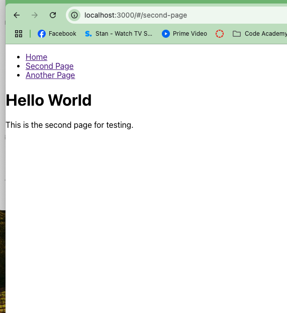
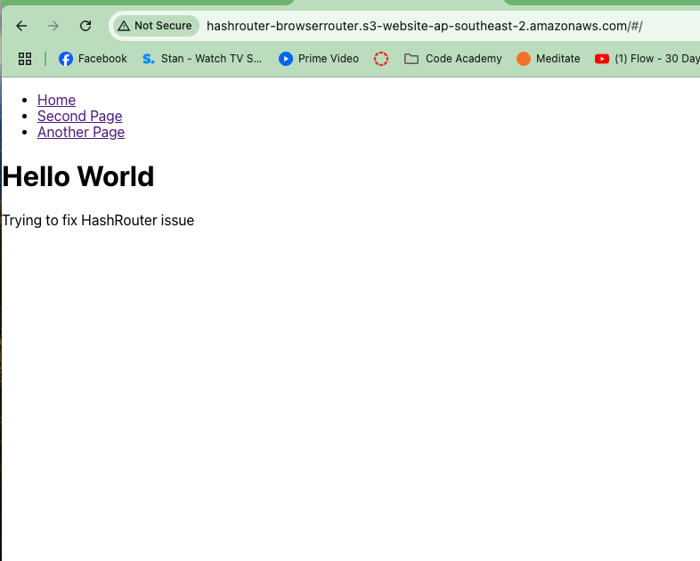
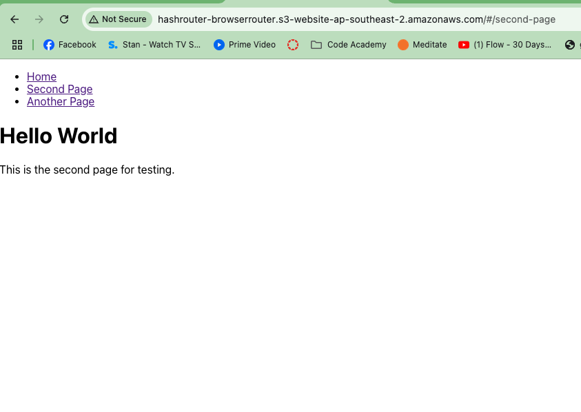
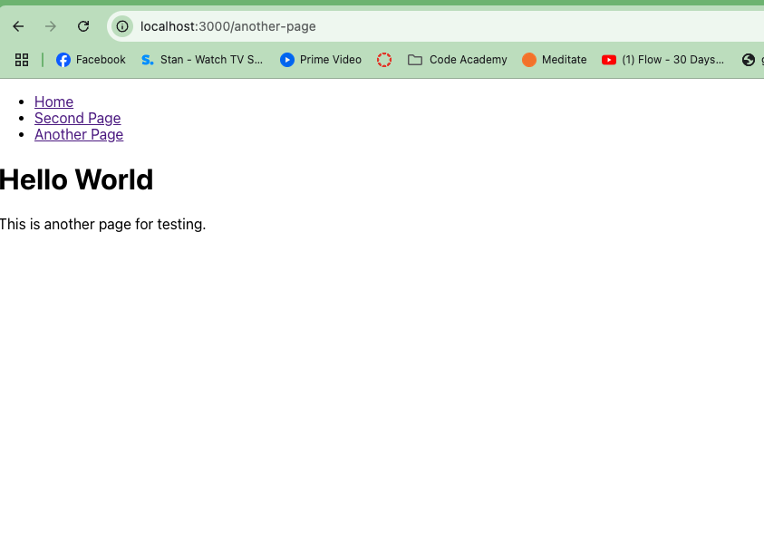
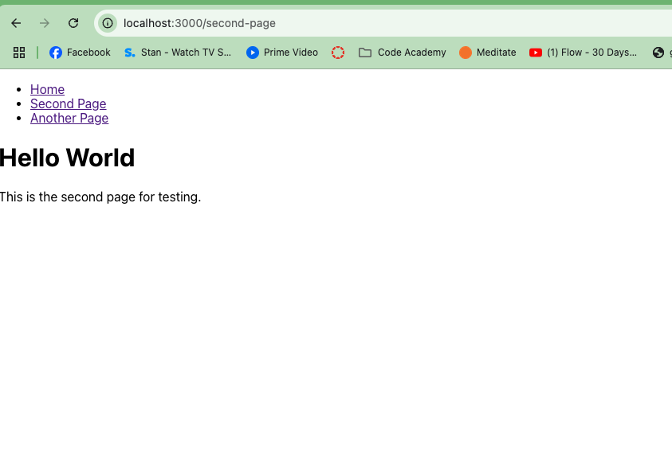

# GoDriving Internship - Fixing the # Issue in the URL

## Overview
As part of my internship at GoDriving, my first task is to resolve an issue with the URL containing a # (hash) symbol. This issue is caused by the use of HashRouter in React, which I need to replace with BrowserRouter for clean, SEO-friendly URLs.


### Technologies Involved

* React with TypeScript: GoDriving uses a front-end stack based on React and TypeScript, which is a strongly typed superset of JavaScript that I've never worked with before.
* AWS S3: For hosting the application. This is my first time deploying and configuring a web app to be served through AWS.
* React Router: Handles routing within the application. The issue arises from using HashRouter, and I need to transition to BrowserRouter.

### Step 1: Recreate the Issue and Deploy to AWS

To better understand and resolve the issue, I first recreated the problem locally using HashRouter to display the # in the URL. Here's what I did:

#### Created a simple React Single Page Application (SPA) with three pages:

* Home: A page indicating that I'm attempting to fix the issue.
* Second Page: A second page for testing.
* Another Page: A third page for further testing.

All pages also display "Hello World."

##### Local Setup:

Ran the app locally using HashRouter to demonstrate the problem.




#### AWS deployed: 

Deployed the app to AWS S3 to simulate the issue in a live environment.





http://hashrouter-browserrouter.s3-website-ap-southeast-2.amazonaws.com/#/second-page

As expected the # is present in the URL

### Step 2: Fixing the Issue

After demonstrating the issue, I will replace HashRouter with BrowserRouter to remove the # from the URL. 

HashRouter src/app.tsx
``` js
import React from 'react';
import { HashRouter, Route, Routes, Link } from 'react-router-dom';
import Home from './components/Home';
import SecondPage from './components/SecondPage';
import AnotherPage from './components/AnotherPage';

const App: React.FC = () => {
    return (
        <HashRouter>
            <nav>
                <ul>
                    <li><Link to="/">Home</Link></li>
                    <li><Link to="/second-page">Second Page</Link></li>
                    <li><Link to="/another-page">Another Page</Link></li>
                </ul>
            </nav>
            <Routes>
                <Route path="/" element={<Home />} />
                <Route path="/second-page" element={<SecondPage />} />
                <Route path="/another-page" element={<AnotherPage />} />
            </Routes>
        </HashRouter>
    );
};

export default App;
```


BrowserRouter src/app.tsx
``` js 
import React from 'react';
import { BrowserRouter as Router, Route, Routes, Link } from 'react-router-dom';
import Home from './components/Home';
import SecondPage from './components/SecondPage';
import AnotherPage from './components/AnotherPage';

const App: React.FC = () => {
    return (
        <Router>
            <nav>
                <ul>
                    <li><Link to="/">Home</Link></li>
                    <li><Link to="/second-page">Second Page</Link></li>
                    <li><Link to="/another-page">Another Page</Link></li>
                </ul>
            </nav>
            <Routes>
                <Route path="/" element={<Home />} />
                <Route path="/second-page" element={<SecondPage />} />
                <Route path="/another-page" element={<AnotherPage />} />
            </Routes>
        </Router>
    );
};

export default App;
```

#### Local Testing




#### Updating the routing logic in the app.
Reconfiguring AWS S3 to handle client-side routing correctly by redirecting all requests to index.html.
I will document this process, take additional screenshots, and capture the steps required to solve the issue.

  

http://hashrouter-browserrouter-solution.s3-website-ap-southeast-2.amazonaws.com/another-pagedasfda
