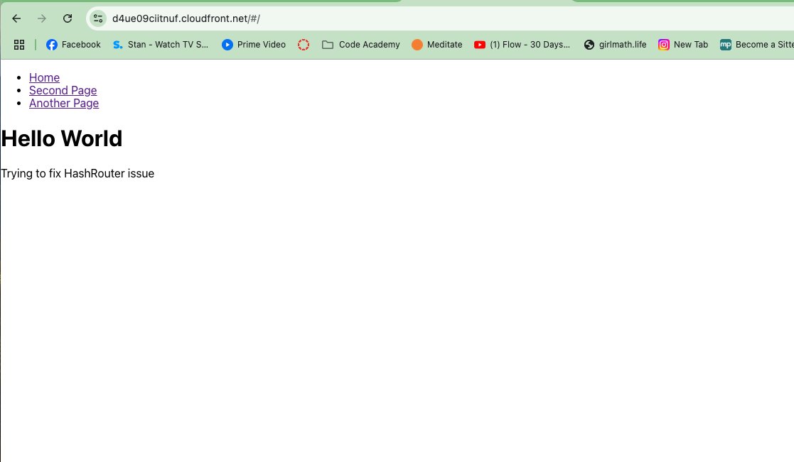
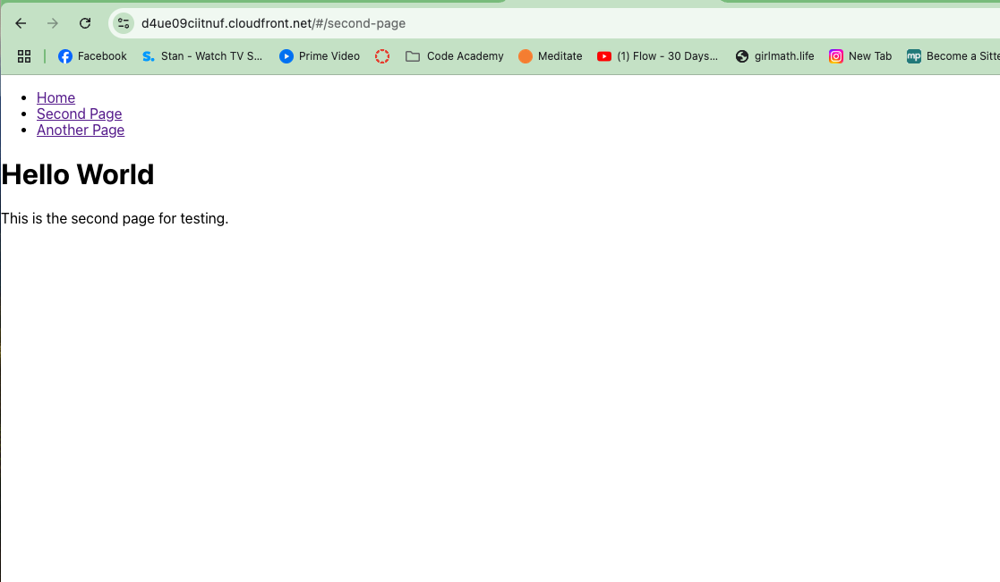
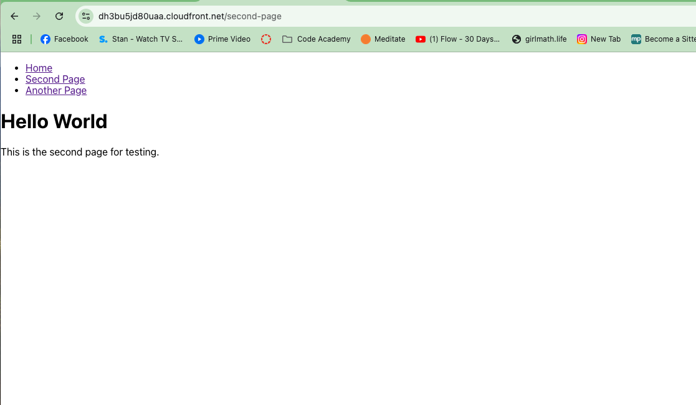

# GoDriving Internship - Fixing the # Issue in the URL

## Overview
As part of my internship at GoDriving, my first task is to resolve an issue with the URL containing a # (hash) symbol. This issue is caused by the use of HashRouter in React, which I need to replace with BrowserRouter for clean, SEO-friendly URLs.


### Technologies Involved

* React with TypeScript: GoDriving uses a front-end stack based on React and TypeScript, which is a strongly typed superset of JavaScript that I've never worked with before.
* AWS S3: For hosting the application. This is my first time deploying and configuring a web app to be served through AWS.
* React Router: Handles routing within the application. The issue arises from using HashRouter, and I need to transition to BrowserRouter.

### Step 1: Recreate the Issue and Deploy to AWS

To better understand and resolve the issue, I first recreated the problem locally using HashRouter to display the # in the URL. Here's what I did:

#### Created a simple React Single Page Application (SPA) with three pages:

* Home: A page indicating that I'm attempting to fix the issue.
* Second Page: A second page for testing.
* Another Page: A third page for further testing.

All pages also display "Hello World."

##### Local Setup:

Ran the app locally using HashRouter to demonstrate the problem.


#### AWS deployed: 

Deployed the app to AWS S3 to simulate the issue in a live environment.


http://hashrouter-browserrouter.s3-website-ap-southeast-2.amazonaws.com/#/second-page

As expected the # is present in the URL

### Step 2: Fixing the Issue

After demonstrating the issue, I will replace HashRouter with BrowserRouter to remove the # from the URL. 

HashRouter src/app.tsx
``` js
import React from 'react';
import { HashRouter, Route, Routes, Link } from 'react-router-dom';
import Home from './components/Home';
import SecondPage from './components/SecondPage';
import AnotherPage from './components/AnotherPage';

const App: React.FC = () => {
    return (
        <HashRouter>
            <nav>
                <ul>
                    <li><Link to="/">Home</Link></li>
                    <li><Link to="/second-page">Second Page</Link></li>
                    <li><Link to="/another-page">Another Page</Link></li>
                </ul>
            </nav>
            <Routes>
                <Route path="/" element={<Home />} />
                <Route path="/second-page" element={<SecondPage />} />
                <Route path="/another-page" element={<AnotherPage />} />
            </Routes>
        </HashRouter>
    );
};

export default App;
```


BrowserRouter src/app.tsx
``` js 
import React from 'react';
import { BrowserRouter as Router, Route, Routes, Link } from 'react-router-dom';
import Home from './components/Home';
import SecondPage from './components/SecondPage';
import AnotherPage from './components/AnotherPage';

const App: React.FC = () => {
    return (
        <Router>
            <nav>
                <ul>
                    <li><Link to="/">Home</Link></li>
                    <li><Link to="/second-page">Second Page</Link></li>
                    <li><Link to="/another-page">Another Page</Link></li>
                </ul>
            </nav>
            <Routes>
                <Route path="/" element={<Home />} />
                <Route path="/second-page" element={<SecondPage />} />
                <Route path="/another-page" element={<AnotherPage />} />
            </Routes>
        </Router>
    );
};

export default App;
```

#### Local Testing


#### Updating the routing logic in the app.
Reconfiguring AWS S3 to handle client-side routing correctly by redirecting all requests to index.html.
I will document this process, take additional screenshots, and capture the steps required to solve the issue.

  

http://hashrouter-browserrouter-solution.s3-website-ap-southeast-2.amazonaws.com/another-pagedasfda

## Cloudfront

I was requested to deploy CloudFront to the above to see if my solution is working. 


### Original hash route
Original hash route: https://d4ue09ciitnuf.cloudfront.net
I deployed the original has route on cloudfront to demonstrate the problem 

 

### Browser Router  
Solution (without #): https://dh3bu5jd80uaa.cloudfront.net

 

## Update 1
After further discussion, it was explained that we cannot use a static website deployment on an S3 bucket due to cybersecurity concerns. As a result, we have been instructed to explore alternative solutions:

* Using '?' or Different Symbols Instead of '#'
* Convert to Next.js with Server-Side Rendering (SSR)

### CloudFront Custom Error Response
I found an article ([AWS Hosting S3 Single Page Applications](https://zirkelc.dev/posts/aws-hosting-s3-single-page-applications)) suggesting the use of a CloudFront Custom Error Response to resolve the issue without relying on a static website deployment. 

For this deployment using **BrowserRouter**, I managed to remove the # from the URL successfully. However, there is still an issue when the page is refreshed, resulting in an error. I need more time to investigate how to fully resolve the refresh problem. Please see the screenshots below:

During testing, we encountered an issue when refreshing pages, as the main JavaScript file (main.js) was being fetched from an incorrect location. This issue was caused by differences between relative (./) and absolute (/) paths in the JSON package. This has now been addressed, and we're moving forward with testing.


#### Removal of # in URL


#### Error Message When Refreshing


### Using '?' or Different Symbols Instead of '#'
I am still researching this option. In theory, using a different symbol allows routing without requiring static hosting or server changes. However, this is a non-conventional approach for SPA routing and may create complexity in maintaining and parsing routes, potentially interfering with query parameters and leading to conflicts. Due to these limitations, I do not believe this is a viable option.

### Convert to Next.js with Server-Side Rendering (SSR)
For this approach, I plan to convert the existing React app to Next.js to leverage server-side rendering (SSR) and static generation.

The Next.js SSR option is currently on hold for now, though I plan to revisit it personally to enhance my knowledge in SSR with Next.js.

**What Needs to Be Done:**
1. **Install Next.js in the Current React Project:** 
   - Install Next.js and its required dependencies.
2. **Restructure Files:** 
   - Move all components that should be accessible via routes into a `/pages` directory. Each file in `/pages` will automatically become a route in Next.js.
3. **Update Routing:** 
   - Replace React Router with Next.js's built-in routing. This means removing BrowserRouter and using Next.js Links for navigation.
4. **Add Server-Side Functions (Optional):** 
   - Use `getServerSideProps` for pages that require server-side data fetching to ensure dynamic content.
5. **Deploy to a Server Environment:** 
   - Deploy the Next.js app to a server or cloud provider that supports SSR, such as Render, AWS Amplify, or AWS EC2.

I am working on deploying a test version to demonstrate that this approach works and have created another GitHub repository to test this idea: [Node.js Solution GitHub Repo](https://github.com/gysagsohn/nodejs-solution). 

Since I am not very experienced with AWS and Next.js, this process is taking some time. I will update the repository once this option has been fully tested.
 